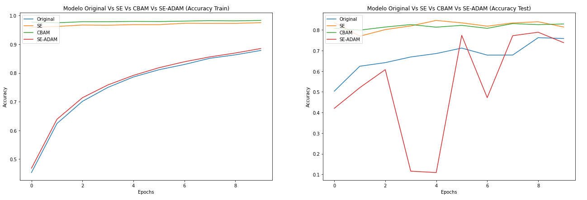
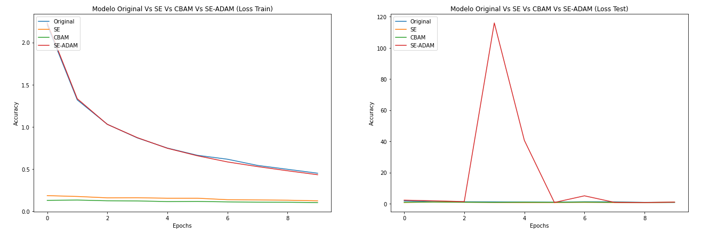
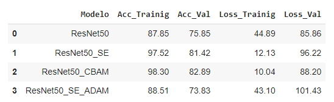
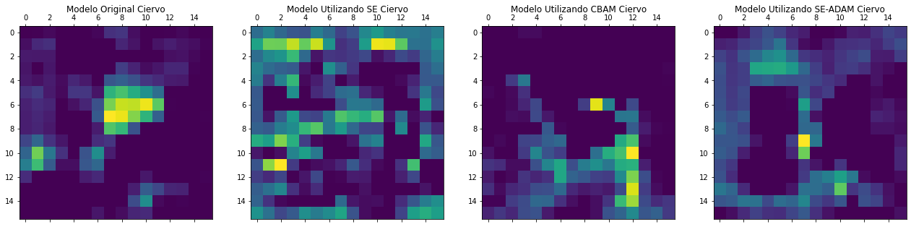
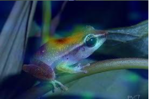

# **Resnet50 - SE -  CBAM - SE_ADAM** #
## **Diseñado por:**
* *Alba Maria Ramirez Marquinez*
    * **Código:** 2216260
* *Milton Guarin Arias* 
    * **Código:** 2210702
* *Carlos Arbey Mejia Martinez*
    * **Código:** 2210549
* *Andres Felipe Guerra Vargas* 
    * **Código:** 2211058

## **Contenido** ##

En este repositorio se podrá encontrar la documentación, fuentes y resultados llevados a cabo en la comparación de los modelos de la arquitectura RestNet 50 utilizando diferentes modelos de atención aplicados al dataset **CIFAR10**:

* ResNet50 original (sin módulo de atención)
* ResNet50 con módulo de atención Squeeze-Excitation
* Resnet50 con módulo de atención CBAM

<p align="center">

</P>

## **Construcción del repositorio:** ##

Para llevar a la construcción del proyecto, se estableció un repositorio en  [Google Drive](https://drive.google.com/file/d/1aar-eZAy8nYX8TlmvjE2uV6RvF6J5Eyz/view?usp=drive_web&authuser=0) donde se almaceno la siguiente información:

```bash
├───Modelos
│   └───.ipynb_checkpoints
├───Data
│   └───.ipynb_checkpoints
└───img
```
*   **Data:** Se almacenaron los archivos Json con los valores de resultados de los diferentes entrenamientos de los modelos, aquí se almaceno la información de **loss** y **accuracy** de las últimas 10 épocas tanto para el dateset de entrenamiento como el de validación.

*   **Modelos:** Se almacenaron los archivos h5 de los de los modelos entrenados, almacenando la arquitectura completa con sus pesos en un archivo y en otro solo los pesos por si son necesarios.

*   **img:** Se almacena los archivos png y jpg de las imágenes de validación final de los modelos y sus diferentes resultados con la aplicación del heatmap respectivo, para así poder visualizar la atención de la última capa de activación de cada modelo.

Los diferentes modelos se entrenaron de manera independiente y en paralelo en diferentes equipos para un total en promedio de 40 épocas. Esta cantidad de épocas se debe a la limitación que se tiene de entrenamiento de GPU utilizando Google Colab, el cual solo nos permitía entrenar 10 épocas por cuenta, en las validaciones realizadas se evidenció que en los casos de haber entrenado 10 épocas y lanzado otras 10, esta tarea siempre se finalizaba por Google Colab al redor de la época 9 perdiendo todos los resultados. Dado que Google Colab nos penalizaba, se realizó el entrenamiento por 3 cuentas adicionales por ingeniero para así poder realizar la cantidad de épocas indicadas arriba.

Se utilizó un único archivo para el entrenamiento y validación de todos los modelos nombrado **ResNet50_SE_y_CBAM.ipynb** el cual puede ser encontrado en este repositorio en la ruta:
```bash
Resnet50_SE_CBAM\Modelos\ResNet50_SE_y_CBAM.ipynb
```

En este archivo se podrá encontrar las funciones y librerías usadas para la construcción de este proyecto, esta construcción se realizó bajo la explicación del profesor **Juan Carlos Perafan** en su clase de Deep Learning Avanzado en la Especialización de Inteligencia Artificial 2021.

## **Resultados:** ##

Implementamos dos mecanismos de atención, Squeeze-Excitation (SE) y Módulo de Atención de Bloques Convolucionales (CBAM), aplicado a una arquitectura básica ResNet50 buscando mejorar su poder representación e intentando replicar los resultados obtenidos por los autores y creadores de los respectivos módulos de atención.

Validación del Accuracy de los modelos:
<p align="center">

</P>

Validación de Loss de los modelos:
<p align="center">

</P>

Para el análisis presentamos los resultados de rendimiento de nuestros modelos propuestos RESNET50, RESNET50-SE y RESNET50-CBAM aplicados a la base de datos CIFAR10:

<p align="center">

</P>

Se puede observar que el modelo RESNET50-CBAM, supera a los demás modelos contando con un accuracy de 82.89% y un 0.88 en la función de perdida, lo que en teoría mejora la clasificación de las imagenes, sin embargo observando el heatmap de cada imagen y modelo, vemos que la atención la realiza mejor el modelo RestNet_SE con Adam Ajustado.

Validación del Heatmap de las 3 arquitecturas, última imagen con SE parametrizada el ADAM:

<p align="center">
 
 

 
 

 
 


</P>

A continuación se muestra la validación de las arquitecturas en 3 diferentes imágenes de pruebas visualizando la atención con GrandCam:

* Arquitectura original.
    <p align="center">
    
    
    
     
    
    
    </P> 
*  Squeeze Excitation
    <p align="center">
    
    
    
     
    
     
    </P>
*  Squeeze Excitation Adam ajustado.
    <p align="center">
    
    
    
      
    
     
    </P>
*  CBAM
    <p align="center">
    
     
    
     
    
    
    </P> 

## **Conclusiones y aprendizajes:** ##

A través de la implementación realizada y descrita anteriormente, se pudo validar que los mecánismos o modelos de atención definitivamente mejoran el poder de foco de las redes neuronales convulucionales y su representación.   El uso de cada mecanismo de atención dependerá de la tarea que se quiera realizar, el dataset seleccionado y por supuesto, el tiempo de entrenamiento de cada modelo.  En este caso, si bien tuvimos un aceptable desempeño en cada una de los modelos implementados, se esperaba obtener una mejor distribución de los heatmaps en cada imagen que realmente enfocara el objetivo, sin embargo, tuvimos problemas con la herramienta utilizada para el entrenamiento, ya que cada ciertas epocas se reiniciaba y bloqueaba las cuentas utilizadas (googlecolab).  

En se sentido, si bien la implementación de los módulos de atención en la arquitectura de red (RestNet50) fue exitosa, concluimos que el entrenamiento require de muchas más épocas para obtener resultados más acordes que coincidan con los resultados presentados en los papers de los autores de los modelos.


## **Links alternos al repositorio:** ##
* [Repositorio Google Drive Tarea](https://drive.google.com/file/d/1aar-eZAy8nYX8TlmvjE2uV6RvF6J5Eyz/view?usp=drive_web&authuser=0)

## **Referencias:** ##
* [ResNet](https://drive.google.com/file/d/1aar-eZAy8nYX8TlmvjE2uV6RvF6J5Eyz/view?usp=drive_web&authuser=0)
* [Squeeze - Excitation 1](https://drive.google.com/file/d/1_zvn6gjB-S0EaOxAxp7f8TYLvBq0dHP2/view?usp=drive_web&authuser=0)
* [Squeeze - Excitation 2](https://drive.google.com/file/d/1ebtN-ui9z0QIX1faMAuGBxdvkRYBHyeT/view?usp=drive_web&authuser=0)
* [CBAM / PAY ATTENTION 1](https://drive.google.com/file/d/1LRkUOcBcXL3lqRMbBzlirvWOu56eiUq6/view?usp=drive_web&authuser=0)
* [CBAM / PAY ATTENTION 2](https://drive.google.com/file/d/14aMNJp6Y-3KAsuoQzx3KUDI8cdzp0Djv/view?usp=drive_web&authuser=0)
