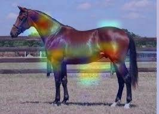
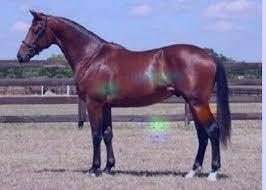
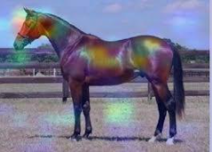

# **Resnet50 - SE -  CBAM** #
## **Diseñado por:**
* *Alba Maria Ramirez Marquinez*
    * **Código:** 2216260
* *Milton Guarin Arias* 
    * **Código:** 2210702
* *Carlos Arbey Mejia Martinez*
    * **Código:** 2210549
* *Andres Felipe Guerra Vargas* 
    * **Código:** 2211058

## **Contenido** ##
En este repositorio se podrá encontrar la documentación, fuentes y resultados llevados a cabo en la comparación de los modelos de la arquitectura Rest Net 50 utilizando diferentes modelos de atención:

*  Arquitectura original.
    

    
    
    

*  Squeeze Excitation
    

    
    
    

*  Squeeze Excitation Adam ajustado.
    

    
    
    

*  CBAM
    

    
     
    

## **Links alternos al repositorio:** ##
* [ResNet](https://drive.google.com/file/d/1aar-eZAy8nYX8TlmvjE2uV6RvF6J5Eyz/view?usp=drive_web&authuser=0)
* [Squeeze - Excitation 1](https://drive.google.com/file/d/1_zvn6gjB-S0EaOxAxp7f8TYLvBq0dHP2/view?usp=drive_web&authuser=0)
* [Squeeze - Excitation 2](https://drive.google.com/file/d/1ebtN-ui9z0QIX1faMAuGBxdvkRYBHyeT/view?usp=drive_web&authuser=0)
* [CBAM / PAY ATTENTION 1](https://drive.google.com/file/d/1LRkUOcBcXL3lqRMbBzlirvWOu56eiUq6/view?usp=drive_web&authuser=0)
* [CBAM / PAY ATTENTION 2](https://drive.google.com/file/d/14aMNJp6Y-3KAsuoQzx3KUDI8cdzp0Djv/view?usp=drive_web&authuser=0)
